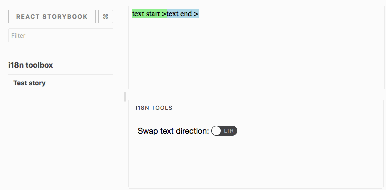

# I18n Toolbox Storybook Add-on

[](https://greenkeeper.io/)

[](https://travis-ci.org/joscha/storybook-addon-i18n-tools)
[](https://github.com/semantic-release/semantic-release)
[](http://commitizen.github.io/cz-cli/)


The i18n toolbox addon can be used to swap text direction in stories. This addon works with [React Storybook](https://github.com/kadirahq/react-storybook).



## Getting Started

First, install the addon

```shell
npm install -D storybook-addon-i18n-tools
```

Add this line to your `addons.js` file (create this file inside your storybook config directory if needed).

```js
import 'storybook-addon-i18n-tools/register';
```

Import the addon in your storybook config to initialize it:

```js
import 'storybook-addon-i18n-tools';
```

## Known issues
* Toggle button state does not reset [when navigating away from the current story](https://github.com/kadirahq/react-storybook/issues/568) (PR would be 💖)
